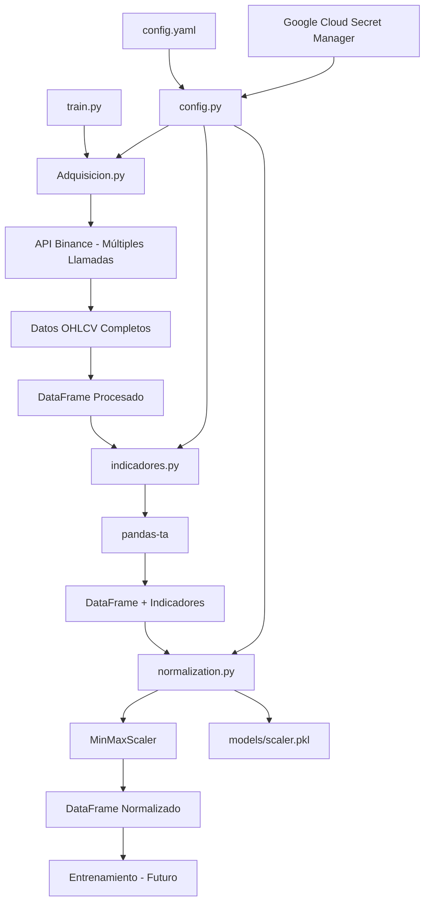

# Trading Bot con Reinforcement Learning para Futuros de Criptomonedas

> **⚠️ ADVERTENCIA IMPORTANTE ⚠️**
> 
> Este bot utiliza órdenes a MERCADO que se ejecutan inmediatamente al mejor precio disponible, lo que puede resultar en slippage significativo en mercados volátiles o con baja liquidez. 
> 
> Además, existe una discrepancia importante entre entrenamiento y operación en vivo: en entrenamiento se considera el "tiempo en posición" como característica, pero en modo real esta característica se establece como un valor constante (0.0). Esto puede causar que el rendimiento en vivo difiera considerablemente del backtesting.
> 
> **Utilice este software bajo su propia responsabilidad. Los resultados del backtesting no garantizan resultados similares en trading en vivo.**

## 📋 Tabla de Contenidos

- [Descripción General](#-descripción-general)
- [Estructura del Proyecto](#-estructura-del-proyecto)
- [Arquitectura y Principios](#-arquitectura-y-principios)
- [Configuración](#-configuración)
- [Instalación](#-instalación)
- [Uso](#-uso)
- [Módulos del Sistema](#-módulos-del-sistema)
- [Flujo de Datos](#-flujo-de-datos)
- [Consideraciones Técnicas](#-consideraciones-técnicas)
- [Dependencias](#-dependencias)

## 🤖 Descripción General

Este proyecto implementa un bot de trading automatizado que utiliza técnicas de Reinforcement Learning para operar en futuros de criptomonedas. El sistema está diseñado con una arquitectura modular que permite el procesamiento eficiente de datos históricos, cálculo de indicadores técnicos y entrenamiento de modelos de IA.

### Características Principales

- **Adquisición de datos**: Descarga automática de datos OHLCV desde la API de Binance con múltiples llamadas secuenciales
- **Indicadores técnicos**: Cálculo de múltiples indicadores usando pandas-ta
- **Normalización de datos**: Escalado MinMax para optimizar el entrenamiento del modelo
- **Configuración centralizada**: Gestión unificada de parámetros en YAML
- **Optimización de memoria**: Uso eficiente de RAM con tipos de datos optimizados
- **Logging completo**: Seguimiento detallado de todas las operaciones
- **Gestión de secretos**: Integración con Google Cloud Secret Manager

## 🏗️ Estructura del Proyecto

```
btcbot/
├── train.py                    # Script principal de entrenamiento
├── requirements.txt           # Dependencias del proyecto
├── README.md                 # Documentación
├── LICENSE                   # Licencia
├── src/                      # Código fuente principal
│   ├── __init__.py
│   ├── configuration/        # Gestión de configuración
│   │   ├── __init__.py
│   │   ├── config.py        # Clase de configuración
│   │   └── config.yaml      # Parámetros de configuración
│   └── data/                # Módulos de procesamiento de datos
│       ├── __init__.py
│       ├── Adquisicion.py   # Adquisición de datos de Binance
│       ├── indicadores.py   # Cálculo de indicadores técnicos
│       └── normalization.py # Normalización de datos
└── tests/                   # Tests unitarios
    ├── __init__.py
    ├── configuration/
    └── data/
```

## 🏛️ Arquitectura y Principios

### Principios de Diseño

1. **Configuración Centralizada**: Todos los parámetros se gestionan desde `config.yaml`
2. **Separación de Responsabilidades**: Cada módulo tiene una función específica
3. **Optimización de Memoria**: Los DataFrames permanecen en RAM durante todo el pipeline
4. **Logging Exhaustivo**: Trazabilidad completa del procesamiento
5. **Manejo Robusto de Errores**: Validaciones y recuperación ante fallos
6. **Seguridad**: Gestión segura de API keys con Google Cloud Secret Manager

### Patrones Implementados

- **Pipeline de Datos**: Flujo secuencial de procesamiento
- **Factory Pattern**: Configuración dinámica de componentes
- **Observer Pattern**: Logging detallado de eventos
- **Template Method**: Estructura común en clases de procesamiento

## ⚙️ Configuración

### Archivo de Configuración (`config.yaml`)

```yaml
# Parámetros de la API de Binance
api:
  call_limit: 1000          # Máximo de velas por llamada
  max_retries: 3            # Reintentos en caso de error
  retry_delay: 1            # Segundos entre reintentos
  timeout: 10               # Timeout para peticiones

# Configuración de trading
trading:
  testnet: true             # Modo testnet/producción

# Google Cloud
gcp:
  project_id: "btcbot-461022"

# Configuración de datos
data:
  columns: ["Open", "High", "Low", "Close", "Volume"]
  dtypes:
    Open: "float32"
    High: "float32"
    Low: "float32"
    Close: "float32"
    Volume: "float32"

# Zona horaria
timezone:
  target: "Europe/Madrid"   # UTC+1/UTC+2
  source: "UTC"

# Interpolación
interpolation:
  method: "linear"
  limit_direction: "both"

# Configuración de normalización
normalization:
  scaler_type: "MinMaxScaler"  # Tipo de escalador a usar
  feature_range: [0, 1]        # Rango de normalización
  scaler_path: "models/scaler.pkl"  # Ruta donde guardar el scaler

# Indicadores técnicos
indicators:
  trend:
    ema_20:
      period: 20
      enabled: true
    ema_50:
      period: 50
      enabled: true
    adx:
      period: 14
      enabled: true
  momentum:
    rsi:
      period: 14
      enabled: true
    stoch:
      k_period: 14
      d_period: 3
      smooth_k: 3
      enabled: true
  volatility:
    atr:
      period: 14
      enabled: true
  volume:
    obv:
      enabled: true
```

## 🚀 Instalación

### Requisitos Previos

- Python 3.8+
- Cuenta de Binance con API keys
- Google Cloud Project (para gestión de secretos)

### Pasos de Instalación

1. **Clonar el repositorio**
```bash
git clone <repository-url>
cd btcbot
```

2. **Crear entorno virtual**
```bash
python -m venv .venv
source .venv/bin/activate  # En Windows: .venv\Scripts\activate
```

3. **Instalar dependencias**
```bash
pip install -r requirements.txt
```

4. **Configurar API keys en Google Cloud Secret Manager**
```bash
# Configurar las credenciales de Google Cloud
export GOOGLE_APPLICATION_CREDENTIALS="path/to/your/credentials.json"

# Crear secretos en Secret Manager
gcloud secrets create binance-api-key --data-file=- <<< "your-api-key"
gcloud secrets create binance-api-secret --data-file=- <<< "your-api-secret"
```

## 📈 Uso

### Ejecución Básica

```bash
python train.py --symbol BTCUSDT --interval 1h --start-date 2024-01-01
```

### Parámetros Requeridos

- `--symbol`: Símbolo del par de trading (ej: BTCUSDT)
- `--interval`: Intervalo de tiempo (1m, 3m, 5m, 15m, 30m, 1h, 2h, 4h, 6h, 8h, 12h, 1d, 3d, 1w, 1M)
- `--start-date`: Fecha de inicio en formato YYYY-MM-DD

### Ejemplo de Ejecución

```bash
# Descargar datos de Bitcoin en intervalos de 4 horas desde enero 2024
python train.py --symbol BTCUSDT --interval 4h --start-date 2024-01-01

# Descargar datos de Ethereum en intervalos de 1 hora desde marzo 2024
python train.py --symbol ETHUSDT --interval 1h --start-date 2024-03-01
```

## 📦 Módulos del Sistema

### 🎯 Script Principal (`train.py`)

**Función**: Orquesta todo el pipeline de procesamiento de datos y entrenamiento.

**Características**:
- Parsing de argumentos de línea de comandos
- Configuración de logging centralizado
- Validación de parámetros de entrada
- Coordinación entre módulos
- Manejo de errores y interrupciones

**Flujo de Ejecución**:
1. Configuración inicial y validación
2. Fase 1: Adquisición de datos
3. Fase 2: Cálculo de indicadores técnicos
4. Fase 3: Normalización de datos
5. Fase 4: Entrenamiento del modelo (futuro)

### 📊 Configuración (`src/configuration/`)

#### `config.py`
**Función**: Clase centralizada para gestión de configuración.

**Características**:
- Carga automática de `config.yaml`
- Integración con Google Cloud Secret Manager
- Propiedades tipadas para acceso a configuración
- Gestión segura de API keys
- Recarga dinámica de configuración

**Métodos Principales**:
- `binance_api_key`, `binance_api_secret`: Acceso a credenciales
- `data_columns`, `data_dtypes`: Configuración de datos
- `scaler_type`, `feature_range`, `scaler_path`: Configuración de normalización
- `trend_indicators`, `momentum_indicators`: Configuración de indicadores
- `trend_indicators`, `momentum_indicators`: Configuración de indicadores

#### `config.yaml`
**Función**: Archivo de configuración principal con todos los parámetros del sistema.

### 📈 Procesamiento de Datos (`src/data/`)

#### `Adquisicion.py`
**Función**: Descarga y procesamiento de datos OHLCV desde Binance con múltiples llamadas secuenciales.

**Características**:
- **Descarga completa**: Múltiples llamadas secuenciales para obtener todos los datos desde fecha inicio hasta presente
- **Gestión automática de paginación**: Control manual de timestamps para llamadas precisas
- **Límites de API respetados**: Uso del `call_limit` configurado en cada llamada
- **Reintentos robustos**: Backoff exponencial para errores temporales de red
- **Procesamiento eficiente**: Datos mantenidos en RAM durante todo el pipeline
- **Validación y limpieza**: Eliminación de duplicados e interpolación de valores faltantes

**Métodos Principales**:
- `main()`: Orquesta todo el proceso
- `_download_klines_from_api()`: **MEJORADO** - Realiza múltiples llamadas secuenciales hasta obtener todos los datos
- `_create_and_structure_dataframe()`: Crea DataFrame estructurado
- `_remove_duplicates()`: Elimina timestamps duplicados
- `_interpolate_partial_nans()`: Interpola valores faltantes esporádicos
- `_reconstruct_full_sequence()`: Reconstruye secuencia temporal completa
- `_reconstruct_missing_candles()`: Interpola velas completamente faltantes
- `_final_nan_cleanup()`: Limpieza final de NaNs

**Flujo de Procesamiento**:
1. **Descarga secuencial**: Múltiples llamadas a la API hasta obtener todos los datos históricos
2. Conversión a DataFrame con tipos optimizados
3. Eliminación de duplicados y establecimiento de índice temporal
4. Interpolación de valores NaN esporádicos
5. Reconstrucción de secuencia temporal completa
6. Interpolación de velas completamente faltantes
7. Limpieza final de NaNs restantes

#### `indicadores.py`
**Función**: Cálculo de indicadores técnicos usando pandas-ta.

**Características**:
- Cálculo de múltiples categorías de indicadores
- Configuración flexible desde YAML
- Manejo robusto de diferentes versiones de pandas-ta
- Eliminación automática de NaNs iniciales
- Optimización de memoria

**Indicadores Implementados**:

**Tendencia**:
- EMA 20 períodos
- EMA 50 períodos
- ADX 14 períodos

**Momento**:
- RSI 14 períodos
- Stochastic K (14,3,3)

**Volatilidad**:
- ATR 14 períodos

**Volumen**:
- On-Balance Volume (OBV)

**Métodos Principales**:
- `main()`: Orquesta el cálculo de indicadores
- `_calculate_technical_indicators()`: Calcula todos los indicadores
- `_handle_initial_indicator_NaNs()`: Elimina filas con NaNs

#### `normalization.py`
**Función**: Normalización de datos usando MinMaxScaler para optimizar el entrenamiento del modelo.

**Características**:
- **Normalización completa**: Todas las características numéricas escaladas al rango [0, 1]
- **Scaler persistente**: El MinMaxScaler se guarda para uso futuro en producción
- **Validación robusta**: Verificación de rangos y eliminación de valores infinitos/NaN
- **Configuración flexible**: Tipo de scaler y rango configurables desde YAML
- **Información detallada**: Logging completo del proceso y estadísticas del scaler

**Métodos Principales**:
- `main()`: Orquesta todo el proceso de normalización
- `_prepare_features()`: Prepara y valida las características para normalización
- `_fit_scaler()`: Crea y ajusta el objeto MinMaxScaler
- `_save_scaler()`: Guarda el scaler ajustado en archivo .pkl
- `_transform_datasets()`: Aplica la transformación de escalado
- `_validate_normalization()`: Valida que la normalización se aplicó correctamente
- `load_scaler()`: Método estático para cargar scaler previamente guardado
- `get_feature_info()`: Obtiene información detallada sobre el proceso

**Flujo de Normalización**:
1. Preparación y validación de características numéricas
2. Creación y ajuste del MinMaxScaler con los datos
3. Guardado del scaler ajustado para uso futuro
4. Transformación de todas las características al rango [0, 1]
5. Validación de rangos y verificación de calidad

## 🔄 Flujo de Datos



### Transformaciones de Datos

1. **Datos Crudos → Lista de Listas**: Optimización inicial de memoria durante descarga secuencial
2. **Lista → DataFrame**: Estructura pandas con tipos optimizados (`float32`)
3. **DataFrame → DataFrame + Índice Temporal**: Establecimiento de timestamps con zona horaria
4. **DataFrame → DataFrame Limpio**: Eliminación de duplicados, interpolación de NaNs
5. **DataFrame → DataFrame + Indicadores**: Adición de indicadores técnicos (EMA, RSI, ATR, etc.)
6. **DataFrame + Indicadores → DataFrame Sin NaNs**: Eliminación de NaNs iniciales de indicadores
7. **DataFrame → DataFrame Normalizado**: Escalado MinMax de todas las características al rango [0, 1]
8. **Scaler → Archivo Persistente**: Guardado del scaler para uso futuro en producción

## 🔧 Consideraciones Técnicas

### Optimización de Memoria

- **Tipos de Datos**: Uso de `float32` en lugar de `float64` (50% menos memoria)
- **Procesamiento en RAM**: Todo el pipeline mantiene datos en memoria
- **Limpieza Proactiva**: Eliminación temprana de datos innecesarios

### Gestión de API

- **Límites Respetados**: Control automático de rate limits
- **Reintentos**: Recuperación automática ante errores temporales
- **Timeout Configurable**: Prevención de colgados en red

### Seguridad

- **API Keys**: Almacenamiento seguro en Google Cloud Secret Manager
- **No Hardcoding**: Todos los secretos externalizados
- **Logs Seguros**: No exposición de información sensible

### Robustez

- **Validación de Datos**: Verificación en cada etapa
- **Manejo de Errores**: Recuperación y logging detallado
- **Interrupciones**: Manejo elegante de CTRL+C

## 📚 Dependencias

### Principales

- `pandas>=2.0.0`: Manipulación de datos
- `numpy>=1.24.0`: Operaciones numéricas
- `python-binance>=1.0.17`: API de Binance
- `pandas-ta>=0.3.14b`: Indicadores técnicos
- `PyYAML>=6.0`: Configuración YAML
- `google-cloud-secret-manager>=2.16.0`: Gestión de secretos
- `pytz>=2023.3`: Manejo de zonas horarias

### Desarrollo

- `pytest`: Testing unitario
- `logging`: Sistema de logs integrado

## 🔮 Próximas Implementaciones

1. **Normalización de Datos**: Escalado de características
2. **Entrenamiento de Modelo**: Implementación de RL
3. **Backtesting**: Sistema de validación histórica
4. **Trading en Vivo**: Ejecución automática de órdenes
5. **Dashboard**: Interfaz web de monitoreo

---

**Autor**: Sistema de Trading Bot  
**Versión**: 1.0  
**Última Actualización**: Junio 2025