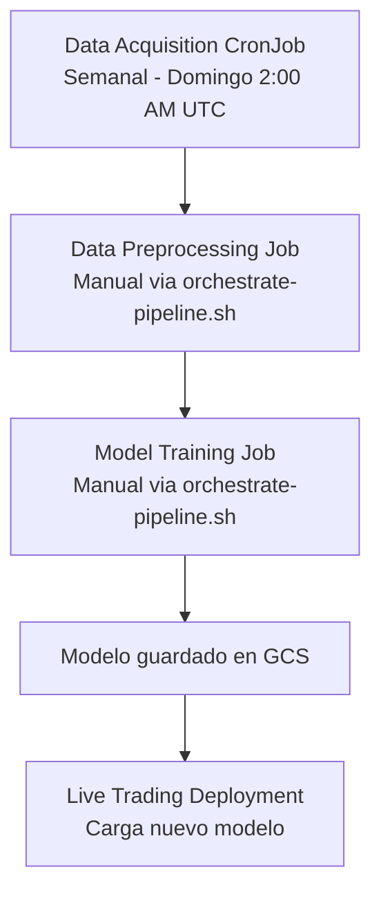

# Orquestación de Pipeline ML con Kubernetes Jobs

Este directorio contiene la configuración de Kubernetes para ejecutar el pipeline de Machine Learning del bot de trading como jobs secuenciales.

## Arquitectura del Pipeline

El pipeline está compuesto por 3 componentes principales:

### 1. **Data Acquisition Job** (CronJob - Semanal)
- **Archivo**: `data-acquisition-job.yaml`
- **Frecuencia**: Cada domingo a las 2:00 AM UTC
- **Función**: Ejecuta `scripts/download_data.py`
- **Recursos**: CPU: 200m-500m, Memory: 256Mi-512Mi

### 2. **Data Preprocessing Job** (Job bajo demanda)
- **Archivo**: `data-preprocessing-job.yaml`
- **Función**: Ejecuta `scripts/preprocess_data.py`
- **Trigger**: Manualmente después de data acquisition
- **Recursos**: CPU: 500m-1, Memory: 1Gi-2Gi

### 3. **Model Training Job** (Job bajo demanda)
- **Archivo**: `model-training-job.yaml`
- **Función**: Ejecuta `scripts/train_rl_agent.py`
- **Trigger**: Manualmente después de preprocessing
- **Recursos**: CPU: 2-4, Memory: 4Gi-8Gi, **GPU: 1** (NVIDIA Tesla T4)

### 4. **Live Trading Deployment** (Deployment continuo)
- **Archivo**: `live-trader-deployment.yaml` (ya existente)
- **Función**: Bot de trading continuo
- **Recursos**: CPU: 500m-1, Memory: 512Mi-1Gi

## Flujo de Ejecución



## Configuración y Despliegue

### 1. Despliegue Automático con Cloud Build
El archivo `cloudbuild.yaml` está configurado para:
- ✅ Construir imágenes Docker (CPU y GPU)
- ✅ Crear/actualizar cluster GKE Autopilot
- ✅ Configurar secretos de Kubernetes
- ✅ Desplegar CronJob de adquisición de datos
- ✅ Desplegar deployment del bot de trading

```bash
# Ejecutar pipeline completo con Cloud Build
gcloud builds submit --config cloudbuild.yaml \
    --substitutions=_SECRET_GCS_BUCKET_NAME=your-bucket,_SECRET_BIGQUERY_LOG_DATASET_ID=your-dataset,_SECRET_USE_TESTNET=true,_SECRET_LOG_LEVEL=INFO
```

### 2. Ejecución Manual del Pipeline ML

#### Opción A: Script de Orquestación (Recomendado)
```bash
# Ejecutar solo preprocesamiento y entrenamiento
./k8s/orchestrate-pipeline.sh

# Ejecutar pipeline completo incluyendo adquisición
./k8s/orchestrate-pipeline.sh --run-acquisition
```

#### Opción B: Ejecución Manual de Jobs Individuales
```bash
# 1. Ejecutar adquisición de datos manualmente (opcional)
kubectl create job --from=cronjob/btcbot-data-acquisition btcbot-data-acquisition-manual -n btcbot

# 2. Ejecutar preprocesamiento
kubectl apply -f k8s/data-preprocessing-job.yaml -n btcbot

# 3. Ejecutar entrenamiento (cuando preprocessing termine)
kubectl apply -f k8s/model-training-job.yaml -n btcbot
```

## Monitoreo y Logs

### Ver estado de jobs
```bash
# Ver todos los jobs
kubectl get jobs -n btcbot

# Ver CronJobs
kubectl get cronjobs -n btcbot

# Ver pods de jobs
kubectl get pods -l app=btcbot -n btcbot
```

### Ver logs de jobs
```bash
# Logs de adquisición de datos
kubectl logs -l component=data-acquisition -n btcbot

# Logs de preprocesamiento
kubectl logs -l component=data-preprocessing -n btcbot

# Logs de entrenamiento
kubectl logs -l component=model-training -n btcbot

# Logs del bot de trading (continuo)
kubectl logs -l component=live-trader -n btcbot -f
```

### Describir jobs para debugging
```bash
# Detalles de un job específico
kubectl describe job btcbot-data-preprocessing -n btcbot

# Ver eventos del namespace
kubectl get events -n btcbot --sort-by='.lastTimestamp'
```

## Configuración de GPU para Entrenamiento

El job de entrenamiento está configurado para usar GPU. Asegúrate de que:

1. **El cluster tenga nodos con GPU disponibles**:
   ```bash
   # Verificar nodos con GPU
   kubectl get nodes -o wide
   kubectl describe nodes | grep -A5 -B5 "nvidia.com/gpu"
   ```

2. **Los drivers de GPU estén instalados** (GKE Autopilot los instala automáticamente)

3. **El nodeSelector y tolerations estén configurados correctamente** en `model-training-job.yaml`

## Variables de Entorno

Todos los jobs usan el mismo secret `btcbot-env-vars` que contiene:
- `GCP_PROJECT_ID`
- `GCS_BUCKET_NAME`
- `GCP_REGION`
- `BIGQUERY_LOG_DATASET_ID`
- `USE_TESTNET`
- `LOG_LEVEL`
- Otras variables según configuración

## Limpieza y Mantenimiento

### Limpiar jobs completados
```bash
# Eliminar jobs completados manualmente
kubectl delete job btcbot-data-preprocessing -n btcbot
kubectl delete job btcbot-model-training -n btcbot

# Los jobs tienen TTL configurado para auto-limpieza:
# - Preprocessing: 24 horas
# - Training: 7 días
```

### Actualizar configuración de CronJob
```bash
# Editar frecuencia de ejecución
kubectl edit cronjob btcbot-data-acquisition -n btcbot

# O aplicar cambios desde archivo
kubectl apply -f k8s/data-acquisition-job.yaml -n btcbot
```

## Troubleshooting

### Job falla por recursos insuficientes
- Verificar que el cluster tenga suficientes recursos
- Ajustar `requests` y `limits` en los archivos YAML

### Job de GPU no encuentra nodos
- Verificar que haya nodos con GPU: `kubectl get nodes -l accelerator=nvidia-tesla-t4`
- Ajustar el `nodeSelector` en `model-training-job.yaml`

### Problemas de permisos
- Verificar que el service account tenga permisos para GCS y secretos
- Revisar la configuración de Workload Identity

### Jobs colgados o en estado pending
```bash
# Ver razón del pending
kubectl describe pod <pod-name> -n btcbot

# Forzar eliminación si es necesario
kubectl delete job <job-name> -n btcbot --force
```
